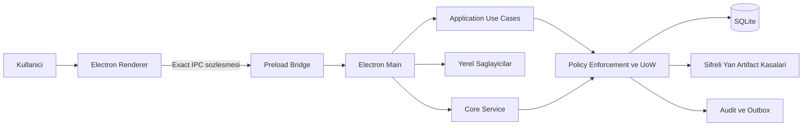

# Sistem Mimarisi

## Mimari hedef

ParsYuva Aile Yasam Merkezi local-first, policy-first ve kanitlanabilir bir masaustu uygulamasidir. Renderer hicbir zaman dosya sistemi, veritabani, gizli anahtar, saglayici tokeni veya yetki receipt'i sahibi olmaz.

## Katmanlar

| Katman | Sorumluluk | Yasak |
|---|---|---|
| Domain | Tipler, durum makineleri, limitler | Dosya, ag, UI |
| Application | Use-case ve portlar | Ham SQL, Electron API |
| Repository Contracts | Kalicilik sozlesmesi | Uygulama davranisi |
| Repositories | Yetkili SQLite islemleri | Renderer cagrisi |
| Security | Kripto, dogrulama, guvenli parser | Kullanici arayuzu |
| Platform Policy | Yetki, kapasite, egress kapilari | Is verisi payloadi |
| Desktop Main | Composition, IPC, yerel cihaz yetkisi | UI kararinin guvenilmesi |
| Renderer | Gorunum, erisilebilirlik, kullanici girdisi | DB, dosya, gizli anahtar, serbest ag |

## Ana ilkeler

- Her yazma merkezi PEP ve Unit of Work icinden gecer.
- Audit/outbox veri mutasyonuyla ayni transactiondadir.
- IPC girdisi ve cikisi exact-key, boyut, tur ve gizli veri kontrollerinden gecer.
- Dosya okuma/yazma main-only ve sabit kok dizinlidir.
- Ag varsayilan kapali; yalniz kayitli adapter ve egress policy acabilir.
- Dis saglayici olmadiginda sentetik basari uretilmez.
- Renderer yeniden baslatilabilir; kalici otorite tasimaz.

## Moduler alanlar

Kimlik, aile, arsiv, finans, saglik, yasam, konum, OCR, AI, iletisim, yedekleme, gizlilik, sistem sagligi ve raporlar ayri domain/application/repository sinirlarina sahiptir. Ortak transaction, audit, outbox, policy ve cihaz kimligi altyapisi tekrar kullanilir.

## Acik mimari borclar

- Uzman panellerin tam Ingilizce kataloglasmasi.
- OCR PDF rasterizer ve dusuk ayricalikli OS sandbox.
- OCR uzun transaction ile eszamanli cancel topolojisi.
- Harita veri paketinin lisansli ve tekrar uretilir tedarigi.
- OneDrive/Google Drive gercek OAuth adapterleri.
- Gercek Apple istemcileri ve cihazlar arasi production senkronizasyon.
- Uretim kod imzalama ve provenance guveni.
