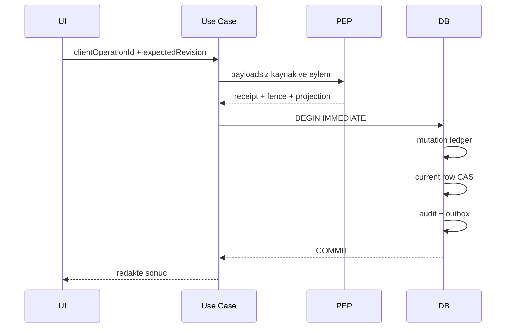

# Veri Mimarisi

## Veri siniflari

| Sinif | Ornek | Varsayilan koruma |
|---|---|---|
| Kimlik | Hesap, kisi, cihaz, MFA | Highly sensitive, sifreli, receipt bagli |
| Aile | Uye, iliski, hane, dal | Owner/family scope |
| Saglik | Kayit, ilac, aile gecmisi | Hassas isleme rizasi |
| Finans | Hesap, kart, borc, portfoy | Hassas isleme rizasi, log redaksiyonu |
| Arsiv | Belge metadata ve sifreli dosya | Vault, hash, retention |
| Iletisim | Mesaj/dosya/toplanti | Icerik ayri sifreli artifact |
| Turetilmis veri | OCR, AI hafiza, indeks | Kaynak lineage ve silme yayilimi |
| Sistem | Audit, outbox, tanilama | Iceriksiz, append-only veya kontrollu retention |

## Kalicilik

- Ana metadata SQLite icindedir.
- Buyuk veya hassas payloadlar korumali yan-artifact kasalarindadir.
- Anahtarlar isletim sistemi korumali secret provider uzerindedir.
- Gecici duz metin dosya uretilmez; zorunlu gecici veri bounded ve temizlenebilirdir.

## Kimlik ve kapsam anahtari

Her yonetilen kayit en az gerekli oldugu olcude `familyId`, `accountId`, `ownerPersonId`, kaynak kimligi, revision, state fingerprint, mutation kimligi ve policy receipt bagi tasir. Cagiran tarafin owner/family degeri kanit sayilmaz; repository metadata ve merkezi policy ile eslenir.

## Mutation modeli

## Migration

- Migration numaralari monotoniktir ve checksum ile sabitlenir.
- Uygulama N-1 veri formatini en azindan yeni semaya tasimayi hedefler.
- Migration oncesi dosya tabanli geri donus kopyasi dogrulanir.
- Sema sonrasi tablo, trigger, indeks ve parmak izi kontrol edilir.
- Kismi migration kabul edilmez.

## Silme ve retention

- Mantiksal silme, fiziksel dosya imhasi ve yedek yayilimi ayri gercekliklerdir.
- Dosya sistemi ile SQLite arasinda sahte atomiklik iddia edilmez.
- Crash penceresi varsa durable resume kaydi gerekir; yoksa risk acik kalir.
- Fiziksel secure erase, SSD/NTFS veya harici kopyalar icin kanitsiz garanti verilmez.
- Audit/outbox delili veri minimizasyonuna uygun bounded retention politikasina baglanir.

## Yedek formati

Sifreli tam yedek; schema surumu, uygulama surumu, veri manifesti, artifact manifesti, hash, boyut, onceki kanit bagi ve restore dogrulama alanlari tasir. Kullanici parolasi veya cihaz korumali anahtar olmadan acilmaz.

