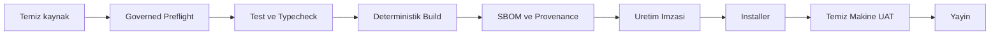

# Platform ve Dagitim Mimarisi

## Mevcut platform

- Birincil: Windows x64 Electron masaustu.
- Kurulum: NSIS tabanli tek gercek dosya ilerleme cubugu.
- Kalici teknik kok kimlik tarihsel artifact okuma uyumlulugu icin korunur; calisan appId ve user-data dizini Bronze, Silver veya Gold kanal ekiyle yalitilir.
- Gorunur kimlik: ParsYuva Aile Yasam Merkezi.
- Kisayol: ParsYuva <Kanal>.
- Varsayilan kurulum hedefi: legacy kokun disindaki C:\Program Files\PPT\ParsYuva-<Kanal> kardes dizini.
- Ana program: ParsYuva-<Kanal>.exe.
- Kaynak calisma alani: C:\PPT\AYM\06_KOD\kanallar\<Kanal> altinda ayri Git worktree ve branch.
- Kullanici veri koku: AppData altinda ParsYuva/<Kanal>; otomatik legacy veri migration veya silme yoktur.

## Gelecek platformlar

| Platform | Yaklasim | Durum |
|---|---|---|
| macOS | Yerel imzali/notarized istemci, ortak domain sozlesmesi | PLANNED |
| iPhone/iPad | Companion, minimum veri ve E2EE | PLANNED |
| Watch/Vision | Sinirli companion bildirim/gorunum | PLANNED |
| Web | Hassas veri otoritesi olmayan destek/hesap veya sinirli portal | UNDECIDED |

## Dagitim zinciri

Kaynak kod veya paketleme davranisi degistiginde onceki `ParsYuva-*.exe`, `.exe.blockmap` ve `.exe.sha256` artefaktlari build baslamadan temizlenir. Release klasoru bos olabilir; paket uretildiginde yalniz guncel gorunur surume ait tek set kabul edilir. Bu temizlik kurulu uygulamaya veya kullanici verisine dokunmaz.

Temiz teslim zinciri tum workspace paketlerini yeniden derler; paketli uygulamanin gercek Windows surecinde acilisini ve surumunu sinar, installer SHA-256 ve imza durumunu kaydeder. Kesin kaynak commit'i GitHub ve harici Git uzak deposunda ayni olmali; ayrica D: harici diskte surum-bagli deterministik kaynak arsivi boyut ve SHA-256 geri-okumasiyla dogrulanmalidir.

## Kanal kurali

- Bronze: gelistirme gercekligi; uretim iddiasi yok.
- Silver: tam regresyon, gercek cihaz/saglayici ve yayin adayi dogrulamasi.
- Gold: uretim imzasi, hukuk/gizlilik, dagitim ve destek kanitlari tamam.

## Guncelleme uyumlulugu

Paket ismi, gorunur marka veya renk kanali degisebilir; her kanalin veri dizini ve appId kimligi kendi icinde kararlidir. Bronze, Silver ve Gold arasinda veri, kaldirma kapsami veya build ciktisi paylasilmaz. Her kanal guncellemesi yalniz kendi mevcut kullanici verisini korur ve gerekirse yeni semaya donusturur.

Surum kimligi paketlemeden once ayri bir mutasyonda exact expected release ID ile bir kez tahsis edilir. Preview yalniz hesaplar ve yazmaz; signed, local unsigned ve dir paket girisleri allocator cagirmadan ledger, kok/desktop manifest, repository metadata ve APP_META uzerindeki ayni onceden tahsisli kimligi fail-closed dogrular.

Kurulu Windows teslim UAT'i yeni containment/reparse korumali evidence kokunde tek uretici tarafindan yurutulur. Birinci faz gercek N->N+1 yukseltme, ikinci faz same-version maintenance olarak ayrilir; sentetik Bronze marker ve icerik okumayan metadata hash manifestleriyle tum kanal/legacy userData korumasi, diger kanal program/registry sifir yazimi, exact installed/package kimligi ve sibling uninstall registry bagi kanitlanir. Schema2 kurulu on yuz UAT ayni UAT110 SHA, package provenance, expected release ID ve source commit bagini tasir.

PR-239 ile package provenance schema2 ve canli PR-235 readback zorunludur. Trusted N yalniz immutable parent package archive ile SHA-256, boyut ve FileVersion exact eslesen sibling Bronze runtime olabilir; legacy nested kurulum degismezlik snapshotidir. Installer-experience V2, UAT110 V2, parent-run UAT111 V3 ve final V3 farkli run/evidence kimliklerinde, tam kronoloji ve screenshot/secret/producer canli geri-okumasi ile kapanir. UAT111 rota ve modul yetkisini Git'te izlenen TypeScript kaynagindan exact okur; gorunur ve uygun butun kontroller outcome ile siniflanir. Native secicilerin CANCEL ve ACCEPT yollari owned Windows penceresi, process identity, screenshot ve uygulama postcondition readback'iyle gercekten yurutulur. Evidence root exclusive ve reparse-korumali tutulur; guard kaybolursa kosu fail-closed durur ve path tabanli cleanup yapilmaz.

Yukseltme veya sessiz bakim onceki kaldiriciyi yikici veri secimine sokmaz. Acik kaldirma akisi ayridir. Ilk aile kurulumu aile, kisi, hesap, uyelik, cihaz, izin ve audit kayitlarini tek SQLite transaction sinirinda olusturur.
