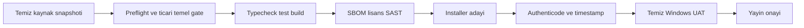

# Ortam ve Yayin Topolojisi

## Ortamlar

| Ortam | Veri | Imza | Dis servis | Dagitim | Tamamlanma iddiasi |
|---|---|---|---|---|---|
| GELISTIRME | Sentetik veya kullanici izinli yerel veri | Gerekmez | Varsayilan kapali/stub | Kaynak calistirma | Yalniz yerel gelistirme |
| TEST | Sentetik, otomatik temizlenen fixture | Test anahtari olabilir | Kayitli mock veya test tenant | CI/yerel artifact | Teknik test kaniti |
| UAT | Kullanici kontrollu gercek cihaz, minimum veri | Uretim adayi | Gercek saglayici test hesabi | Imzali aday | UAT sonucu; uretim degil |
| URETIM | Gercek kullanici verisi | Uretim sertifikasi zorunlu | Onayli hesap/sozlesme | Imzali installer/store | Gold kapilari PASS ise |

## Ayrim kurallari

1. Ortamlar ayni secret, OAuth client, signing key veya veri tabanini paylasmaz.
2. Test fixture uretim yedegine veya kullanici profil yoluna yazamaz.
3. Renderer gizli anahtar, token, path, receipt veya ham kullanici verisi tasiyamaz.
4. Uretim konfigurasyonu kaynak koda gomulmez; main process dogrular ve minimum gorunum yayar.
5. Feature flag yetki veya lisans kontrolu degildir.
6. Uretim veri migrationi forward-only, idempotent ve geri okuma uyumlu tasarlanir; destructive adim ayri receipt ister.

## Windows dagitim akisi

Her ok bir kanit kaydi gerektirir. Imzasiz installer yalniz yerel test artifactidir.

## Apple ve gelecek platformlar

Windows kaniti macOS/iOS kaniti sayilmaz. macOS notarization, entitlements, sandbox, Keychain ve App Store kosullari ayri platform paketi ve gercek cihaz UAT ister. Android gelecekte ayri imza, keystore, Play policy ve cihaz matrisiyle ele alinir.

